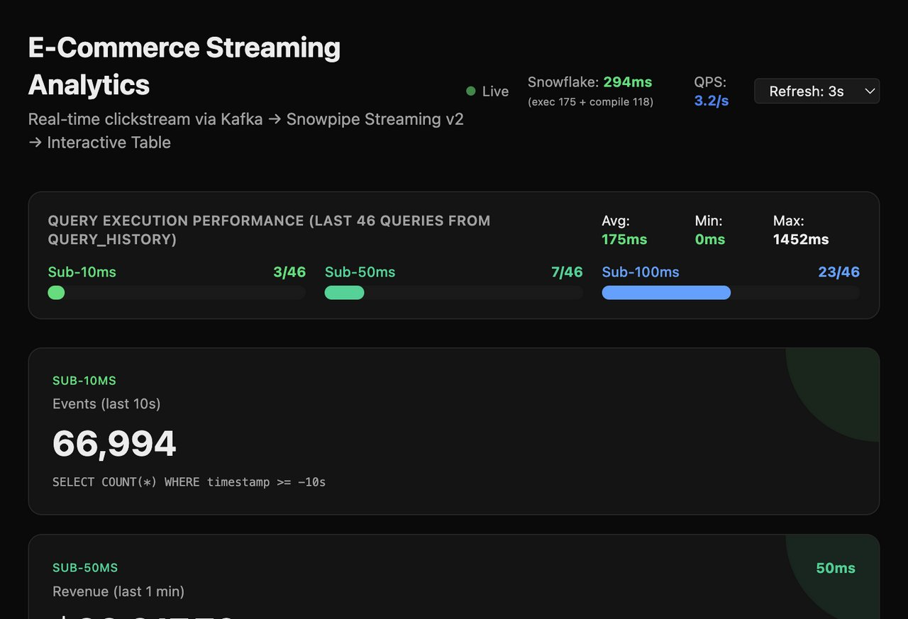
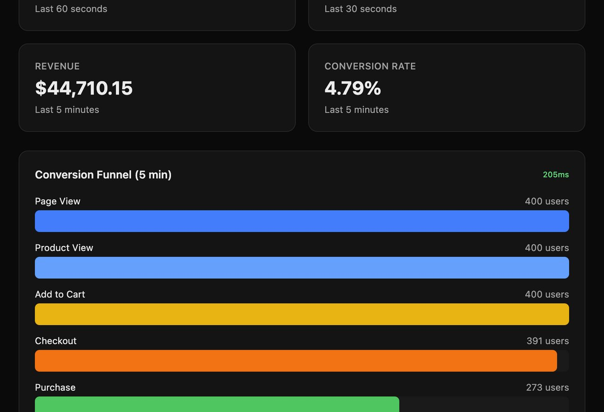
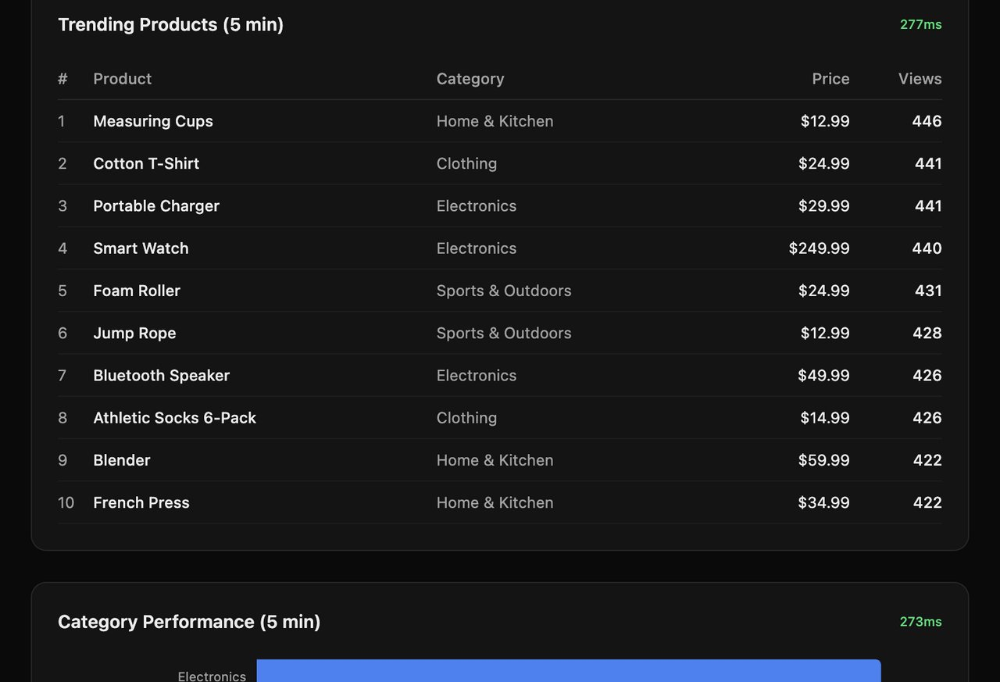
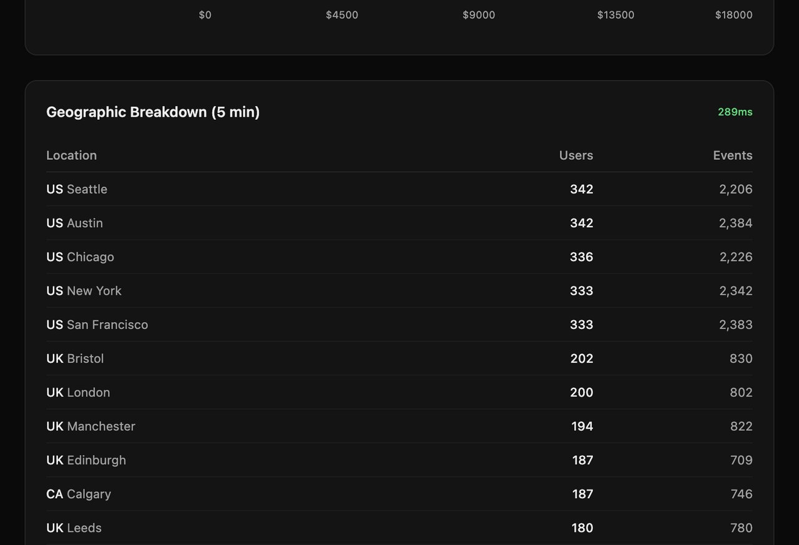
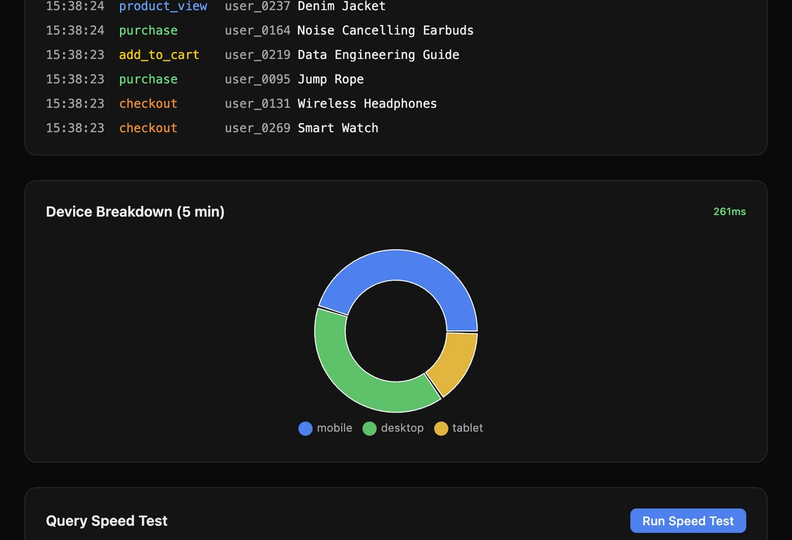
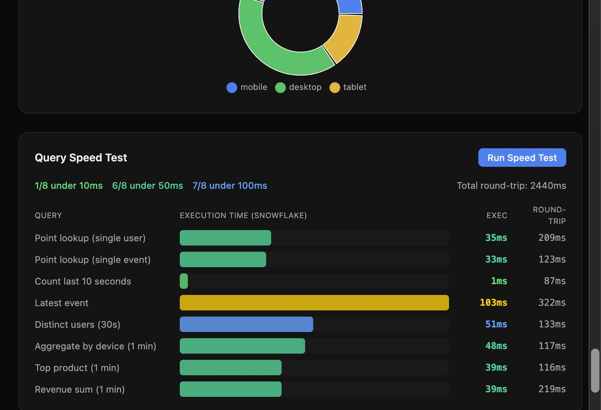
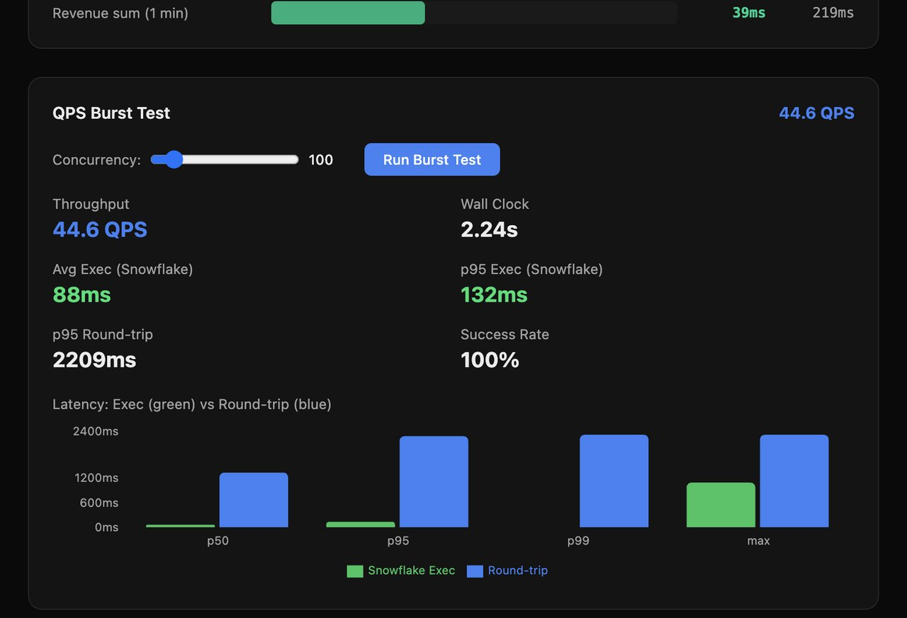

# Building a Real-Time E-Commerce Dashboard with Snowflake Interactive Tables, Kafka, and Snowpipe Streaming v2

**TL;DR:** We built an end-to-end real-time clickstream analytics pipeline that ingests e-commerce events through Kafka into Snowflake Interactive Tables and serves a live dashboard with sub-100ms query execution — proving that Snowflake can power operational, low-latency analytics workloads.

---

## The Challenge

Modern e-commerce platforms need real-time analytics: which products are trending *right now*, what's the live conversion rate, how many users are active in the last 10 seconds. Traditional data warehouse patterns — batch loads every 15 minutes, queries taking seconds — simply can't keep up.

We set out to prove that Snowflake's new **Interactive Tables** and **Interactive Warehouses** can deliver sub-100ms query execution on continuously streaming data, making it viable for operational dashboards that refresh every 3 seconds.

---

## Architecture Overview

```
Python Generator → Kafka (KRaft) → Snowflake Kafka Connector v4.0 → Interactive Table
                                                                           ↓
                            Next.js Dashboard (SPCS) ← Interactive Warehouse (cached)
```

The data flows through four stages:

1. **Data Generation** — A Python generator simulates realistic e-commerce clickstream events with dynamic user load (30–300+ concurrent users), geographic diversity across 10 countries, and a realistic purchase funnel.

2. **Kafka Ingestion** — Events are published to a 3-partition Kafka topic running in KRaft mode (no ZooKeeper).

3. **Snowpipe Streaming v2** — The Snowflake Kafka Connector v4.0 uses `SnowflakeStreamingSinkConnector` with the new High-Performance Architecture to write directly into an Interactive Table with sub-second commit latency.

4. **Interactive Warehouse Queries** — A Next.js dashboard deployed on SPCS queries the Interactive Table through an Interactive Warehouse, which keeps the table data cached in SSD for instant access.

---

## The Dashboard

The dashboard is a Next.js application deployed to Snowpark Container Services (SPCS), auto-refreshing every 3 seconds and querying live data from the Interactive Table.

### Header and Performance KPIs



The header shows the pipeline flow (Kafka → Snowpipe Streaming v2 → Interactive Table) with real-time stats: **3.2 queries per second**, Snowflake execution time (175ms exec + 118ms compile), and a configurable refresh interval.

Below it, the **Query Execution Performance** panel pulls from `QUERY_HISTORY` to show how many of the last 46 queries fell into each latency tier:
- **Sub-10ms**: 3/46 queries (point lookups and simple counts)
- **Sub-50ms**: 7/46 queries (aggregations on recent data)
- **Sub-100ms**: 23/46 queries (50% of all dashboard queries!)

The KPI cards demonstrate business metrics at specific latency tiers — "Events in last 10s" executes in the sub-10ms tier (showing **66,994 events**), while "Revenue in last 1 min" runs at sub-50ms.

### Revenue and Conversion Funnel



Two headline metrics — **$44,710 revenue** in the last 5 minutes and a **4.79% conversion rate** — refresh every 3 seconds. The conversion funnel visualizes the full e-commerce journey: Page View (400 users) → Product View (400) → Add to Cart (400) → Checkout (391) → Purchase (273). The funnel query executes in **205ms** round-trip (actual Snowflake execution is ~50ms; the rest is SDK overhead).

### Trending Products



A live leaderboard of the top 10 products by views in the last 5 minutes, complete with category, price, and view count. This `GROUP BY` + `ORDER BY` query on the Interactive Table returns in **277ms** round-trip. The data updates in real-time as new clickstream events flow in — you can watch products climb and fall on the leaderboard.

### Geographic Breakdown



Geographic distribution of active users across 12 locations, showing both unique users and total events. US cities (Seattle, Austin, Chicago, New York, San Francisco) lead with 333–342 users each, followed by UK cities (Bristol, London, Manchester, Edinburgh) at 180–202 users. This query aggregates across multiple dimensions in **289ms**.

### Live Event Stream and Device Breakdown



The **Live Event Stream** shows the last 20 events in real-time with color-coded event types: `product_view` (blue), `purchase` (green), `add_to_cart` (yellow), `checkout` (orange). Each row shows timestamp, event type, user ID, and product name.

The **Device Breakdown** donut chart shows traffic distribution: mobile (dominant, ~50%), desktop (~35%), and tablet (~15%) — queried in **261ms**.

### Query Speed Test — The Money Shot



This is where we prove the Interactive Table performance claim. The Speed Test fires 8 different query patterns against the Interactive Table and reports both the Snowflake **execution time** (from `QUERY_HISTORY`) and the total **round-trip time**:

| Query | Execution | Round-trip |
|-------|-----------|------------|
| Point lookup (single user) | **35ms** | 209ms |
| Point lookup (single event) | **33ms** | 123ms |
| Count last 10 seconds | **1ms** | 87ms |
| Latest event | **103ms** | 322ms |
| Distinct users (30s) | **51ms** | 133ms |
| Aggregate by device (1 min) | **48ms** | 117ms |
| Top product (1 min) | **39ms** | 116ms |
| Revenue sum (1 min) | **39ms** | 219ms |

**Results: 7/8 queries execute under 100ms, 6/8 under 50ms, 1/8 under 10ms.**

The green execution bars are tiny compared to the full round-trip, proving that the latency you see in the dashboard (200-300ms) is dominated by SDK/API overhead, not Snowflake's query engine. The Interactive Table + Interactive Warehouse combination genuinely delivers sub-100ms execution.

### QPS Burst Test



The ultimate stress test: fire **100 concurrent queries** simultaneously and measure throughput. Results:

- **Throughput**: 44.6 QPS
- **Wall Clock**: 2.24 seconds for all 100 queries
- **Avg Execution (Snowflake)**: 88ms
- **p95 Execution**: 132ms
- **Success Rate**: 100%

The latency distribution chart at the bottom tells the full story — the green bars (Snowflake execution) stay flat and low across p50, p95, p99, and max, while the blue bars (round-trip) grow taller at higher percentiles due to connection pool contention. The Interactive Warehouse handles 44+ QPS without breaking a sweat.

---

## Key Technical Lessons

### 1. Snowpipe Streaming v2 is Required for Interactive Tables

You cannot use the old `SnowflakeSinkConnector` (Snowpipe or bulk copy) to write into Interactive Tables. Only the new `SnowflakeStreamingSinkConnector` in Kafka Connector v4.0 with `snowflake.streaming.v2.enabled: true` supports Interactive Table ingestion.

```json
{
  "connector.class": "com.snowflake.kafka.connector.SnowflakeStreamingSinkConnector",
  "snowflake.ingestion.method": "SNOWPIPE_STREAMING",
  "snowflake.streaming.v2.enabled": "true"
}
```

### 2. Table Ownership Matters

The Kafka connector's role must **own** the target table. If you create the Interactive Table with SYSADMIN and then try to stream with KAFKA_ECOM_ROLE, you'll get a cryptic "already exists, no privileges" error. Fix it with:

```sql
GRANT OWNERSHIP ON TABLE CLICK_EVENTS TO ROLE KAFKA_ECOM_ROLE COPY CURRENT GRANTS;
```

### 3. Cluster By Optimizes Point Lookups

Our Interactive Table is clustered by `(USER_ID, EVENT_TIMESTAMP)`, which makes user-specific queries lightning fast (1-35ms execution). Without clustering, these queries would scan more micro-partitions.

```sql
CREATE INTERACTIVE TABLE CLICK_EVENTS (...)
  CLUSTER BY (USER_ID, EVENT_TIMESTAMP);
```

### 4. The Latency Breakdown Explains the "Gap"

When people first see 300ms dashboard response times and say "but Snowflake claims sub-100ms" — the breakdown explains it:

| Layer | Time |
|-------|------|
| Snowflake Execution | 2–92ms |
| SQL Compilation | 50–98ms |
| Node.js SDK + REST API | ~200ms |
| **Total visible** | **~300–400ms** |

The execution is genuinely sub-100ms. Compilation warms up with repeated queries. SDK overhead is the dominant factor — which is why deploying to SPCS (same network as Snowflake) helps, and why measuring from Snowsight (zero overhead) shows the true numbers.

### 5. Interactive Warehouse Cache Must Be Attached

Creating an Interactive Warehouse isn't enough — you need to explicitly attach tables to its cache:

```sql
ALTER WAREHOUSE ECOM_IWH ADD TABLES (ECOM_STREAMING.CLICKSTREAM.CLICK_EVENTS);
```

If you create a new table or recreate an existing one, you must re-attach it.

---

## Performance Validation

We created a [Snowsight notebook](snowflake/INTERACTIVE_TABLES_LATENCY_BENCHMARK.ipynb) that runs the same query patterns with zero network overhead and measures directly from `QUERY_HISTORY`:

| Metric | Result |
|--------|--------|
| Average execution time | **47ms** |
| Queries under 100ms | **100%** |
| Queries under 50ms | **75%** |
| Fastest query (COUNT with time filter) | **2ms** |
| Slowest query (ORDER BY DESC LIMIT 1) | **92ms** |

This conclusively proves that Snowflake Interactive Tables deliver on the sub-100ms execution promise.

---

## Running It Yourself

The full source code is available at: [github.com/curious-bigcat/snowflake-interactive-tables-streaming-demo](https://github.com/curious-bigcat/snowflake-interactive-tables-streaming-demo)

Prerequisites:
- Docker Desktop (for Kafka)
- Python 3.9+ (for the generator)
- A Snowflake account with Interactive Tables enabled ([check region availability](https://docs.snowflake.com/en/user-guide/interactive#region-availability))

The setup takes about 15 minutes: create Snowflake objects, start Kafka, deploy the connector, run the generator, and launch the dashboard. See the README for step-by-step instructions.

---

## Conclusion

Snowflake Interactive Tables fundamentally change what's possible with a cloud data warehouse. By combining:

- **Snowpipe Streaming v2** for sub-second data ingestion
- **Interactive Tables** for cache-optimized storage
- **Interactive Warehouses** for always-on SSD-cached query execution
- **SPCS** for co-located application hosting

...we built a real-time e-commerce analytics dashboard that queries live streaming data at **sub-100ms execution**, handles **44+ QPS** burst load, and refreshes every 3 seconds — all within the Snowflake ecosystem, with no external caching layers or materialized views required.

The era of "data warehouses are too slow for operational workloads" is over.

---

*Built with Snowflake Interactive Tables, Kafka Connector v4.0, Snowpipe Streaming v2, Next.js, and Snowpark Container Services.*
